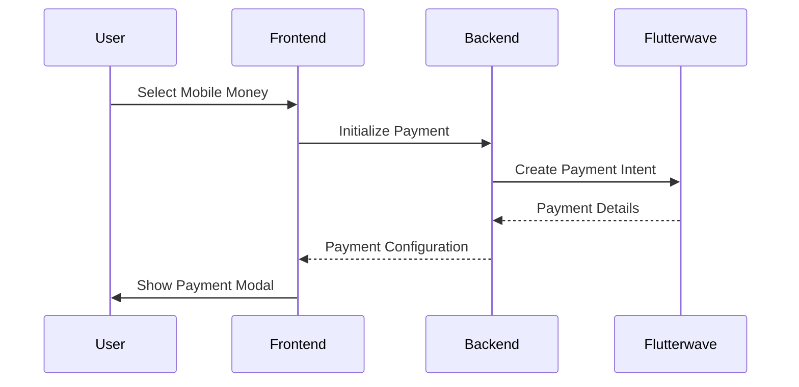
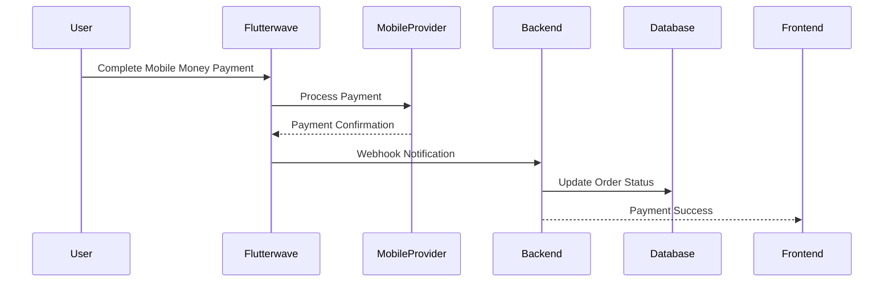

# 📱 Mobile Money Payment Integration Guide

## Overview

TalkCart's mobile money payment system is powered by **Flutterwave** and supports major mobile money providers across Africa including MTN Mobile Money, Airtel Money, Vodacom M-Pesa, and more.

## 🌍 Supported Providers & Countries

| Provider | Countries | Currency Support |
|----------|-----------|------------------|
| **MTN Mobile Money** | Uganda, Rwanda, Ghana, Cameroon | UGX, RWF, GHS, XAF |
| **Airtel Money** | Uganda, Tanzania, Zambia, Kenya | UGX, TZS, ZMW, KES |
| **Vodacom M-Pesa** | Tanzania, DRC, Mozambique | TZS, CDF, MZN |
| **Tigo Pesa** | Tanzania | TZS |
| **Orange Money** | Senegal, Mali, Burkina Faso | XOF |
| **Ecocash** | Zimbabwe | USD |

## 🚀 Quick Setup

### 1. Flutterwave Account Setup

1. **Sign up**: Create account at [flutterwave.com](https://flutterwave.com)
2. **Verify account**: Complete KYC verification
3. **Get API keys**: Navigate to Settings → API Keys
4. **Configure webhooks**: Set webhook URL in dashboard

### 2. Environment Configuration

```bash
# Backend Configuration
FLW_SECRET_KEY=FLWSECK_TEST-your_secret_key_here
FLW_SECRET_HASH=your_webhook_secret_hash

# Frontend Configuration  
NEXT_PUBLIC_FLW_PUBLIC_KEY=FLWPUBK_TEST-your_public_key_here
```

### 3. Test Integration

```bash
# Run verification script
node backend/scripts/verify-mobile-money.js

# Expected output: All checks should pass ✅
```

## 📋 System Architecture

### Backend Components

#### 1. **Payment Routes** (`/backend/routes/payments.js`)
- `POST /api/payments/flutterwave/init` - Initialize Flutterwave payment
- Handles payment initialization with proper validation

#### 2. **Cart Integration** (`/backend/routes/cart.js`)
- `POST /api/cart/flutterwave/init/:currency` - Cart-specific payment init
- `PATCH /api/cart/payment/flutterwave/status` - Update payment status
- Multi-currency support for international transactions

#### 3. **Marketplace Integration** (`/backend/routes/marketplace.js`)
- Direct product purchase with mobile money
- Payment verification via Flutterwave API
- Automatic inventory management

#### 4. **Webhook Handler** (`/backend/routes/webhooks.js`)
- `POST /api/webhooks/flutterwave` - Payment completion notifications
- Secure signature verification
- Automatic order fulfillment

### Frontend Components

#### 1. **FlutterwaveCartCheckout** (`/frontend/src/components/cart/FlutterwaveCartCheckout.tsx`)
```typescript
// Usage in cart checkout
<FlutterwaveCartCheckout
  custom={{
    items: cartItems,
    amount: totalAmount,
    currency: 'USD',
    metadata: { cartId: cart._id }
  }}
  onPaid={({ tx_ref, flw_tx_id, currency }) => {
    // Handle successful payment
  }}
/>
```

#### 2. **BuyModal Integration** (`/frontend/src/components/marketplace/BuyModal.tsx`)
- Direct product purchase with mobile money
- Seamless integration with existing payment tabs
- Real-time payment status updates

#### 3. **API Client** (`/frontend/src/lib/api.ts`)
```typescript
// API methods available
api.cart.initFlutterwaveForCurrency(currency, paymentData)
api.cart.refreshFlutterwavePaymentStatus(statusData)
api.payments.createFlutterwaveIntent(intentData)
```

## 🔄 Payment Flow

### 1. **Initiation**


### 2. **Processing**


## 🧪 Testing Guide

### Test Credentials
```bash
# Flutterwave Test Mode
FLW_SECRET_KEY=FLWSECK_TEST-12345
NEXT_PUBLIC_FLW_PUBLIC_KEY=FLWPUBK_TEST-12345

# Test Phone Numbers (MTN Uganda)
+256700000000  # Always successful
+256700000001  # Always fails
+256700000002  # Requires OTP: 12345
```

### Test Scenarios

1. **Successful Payment**
   - Use test credentials
   - Select MTN Mobile Money
   - Use test phone number `+256700000000`
   - Payment should complete automatically

2. **Failed Payment**
   - Use test phone number `+256700000001`
   - Payment should fail with error message
   - User should be able to retry

3. **OTP Verification**
   - Use test phone number `+256700000002`
   - Enter OTP: `12345`
   - Payment should complete after OTP

### Verification Commands

```bash
# Check system completeness
node backend/scripts/verify-mobile-money.js

# Run comprehensive tests
npm run test:mobile-money

# Test webhook endpoint
curl -X POST http://localhost:8000/api/webhooks/flutterwave \
  -H "Content-Type: application/json" \
  -H "verif-hash: your_secret_hash" \
  -d '{"event": "charge.completed", "data": {...}}'
```

## 🛠️ Troubleshooting

### Common Issues

#### 1. **"Invalid payment amount" Error**
```typescript
// Cause: Amount not properly passed to FlutterwaveCartCheckout
// Solution: Ensure amount is explicitly set
custom={{
  amount: Number(product.price), // ✅ Explicitly set amount
  currency: product.currency.toLowerCase(),
  // ... other props
}}
```

#### 2. **"Flutterwave not configured" Error**
```bash
# Cause: Missing environment variables
# Solution: Set required env vars
export FLW_SECRET_KEY=FLWSECK_TEST-your_key
export NEXT_PUBLIC_FLW_PUBLIC_KEY=FLWPUBK_TEST-your_key
```

#### 3. **Webhook Verification Failed**
```javascript
// Cause: Incorrect webhook signature
// Solution: Verify FLW_SECRET_HASH matches dashboard
const isValid = req.headers['verif-hash'] === process.env.FLW_SECRET_HASH;
```

#### 4. **Payment Modal Not Opening**
```typescript
// Cause: Missing Flutterwave public key
// Solution: Check environment variable
if (!process.env.NEXT_PUBLIC_FLW_PUBLIC_KEY) {
  console.error('Flutterwave public key not configured');
}
```

### Debug Mode

```typescript
// Enable debug logging
const flutterwaveConfig = {
  // ... other config
  meta: {
    ...metadata,
    debug: process.env.NODE_ENV === 'development'
  }
};
```

## 📊 Monitoring & Analytics

### Payment Tracking
```javascript
// Track payment events
analytics.track('mobile_money_payment_initiated', {
  provider: 'flutterwave',
  currency: 'USD',
  amount: 50.00,
  country: 'UG'
});

analytics.track('mobile_money_payment_completed', {
  tx_ref: 'tx_123456',
  provider: 'MTN_MOBILE_MONEY',
  processing_time: '45s'
});
```

### Error Monitoring
```javascript
// Monitor failed payments
Sentry.captureException(new Error('Mobile money payment failed'), {
  extra: {
    tx_ref: paymentData.tx_ref,
    provider: paymentData.provider,
    error_code: response.error_code
  }
});
```

## 🔒 Security Best Practices

### 1. **Environment Variables**
- Never commit `.env` files
- Use different keys for development/production
- Rotate keys regularly

### 2. **Webhook Security**
```javascript
// Always verify webhook signatures
const crypto = require('crypto');
const isValid = crypto.timingSafeEqual(
  Buffer.from(receivedHash),
  Buffer.from(expectedHash)
);
```

### 3. **Amount Validation**
```javascript
// Server-side amount verification
const serverAmount = calculateOrderTotal(cart);
const clientAmount = paymentData.amount;
if (Math.abs(serverAmount - clientAmount) > 0.01) {
  throw new Error('Amount mismatch detected');
}
```

## 🚀 Production Deployment

### 1. **Environment Setup**
```bash
# Production environment variables
FLW_SECRET_KEY=FLWSECK-your_production_key
NEXT_PUBLIC_FLW_PUBLIC_KEY=FLWPUBK-your_production_key
FLW_SECRET_HASH=your_production_webhook_hash
NODE_ENV=production
```

### 2. **Webhook Configuration**
- Set webhook URL: `https://yourdomain.com/api/webhooks/flutterwave`
- Enable events: `charge.completed`, `charge.failed`
- Verify SSL certificate is valid

### 3. **Testing Checklist**
- [ ] Test payments with real mobile money accounts
- [ ] Verify webhook delivery and processing
- [ ] Test currency conversion (if applicable)
- [ ] Validate order fulfillment process
- [ ] Test payment failure scenarios
- [ ] Verify refund process (if implemented)

## 📞 Support & Resources

### Flutterwave Documentation
- [API Documentation](https://developer.flutterwave.com/docs)
- [Mobile Money Guide](https://developer.flutterwave.com/docs/mobile-money)
- [Webhook Documentation](https://developer.flutterwave.com/docs/webhooks)

### TalkCart Support
- Create issue in repository for bugs
- Check existing documentation in `/docs`
- Contact development team for integration support

## 📈 Future Enhancements

### Planned Features
- [ ] **Multi-step payments** - Split payments across multiple mobile money accounts
- [ ] **Recurring payments** - Subscription support via mobile money
- [ ] **Payment links** - Generate shareable payment links
- [ ] **Bulk payments** - Mass payout to vendors via mobile money
- [ ] **Currency conversion** - Real-time exchange rates
- [ ] **Payment analytics** - Detailed reporting dashboard

### Integration Opportunities
- [ ] **Bank transfers** - Direct bank account integration
- [ ] **USSD payments** - Offline payment support
- [ ] **QR codes** - Quick payment via QR scanning
- [ ] **Agent banking** - Cash-in/cash-out support
- [ ] **Blockchain bridge** - Convert mobile money to cryptocurrency

---

**🎉 Congratulations!** Your mobile money payment system is now fully configured and ready to process payments across Africa. Happy coding! 🚀